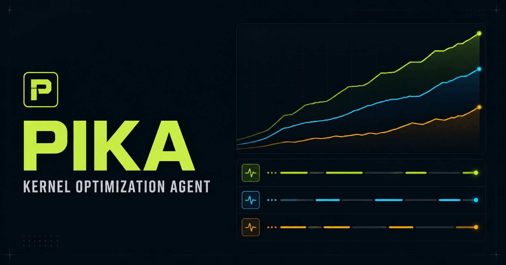

<p align="center">
  
</p>

# Pika

Pika 是一个常驻的单租户 HTTP 服务，用多个 Coding Agent 并行完成 GPU Kernel 的定义、实现、测量和持续调优。

一次 Pika Server 运行对应一个仓库的一次完整 Optimization Campaign。每个性能尝试位于独立 Git worktree；通过正确性与 Pareto Metrics 门禁的结果由 Agent 串行 squash merge 到 Campaign Best Branch。SQLite、Git 和 Artifact Workspace 共同支持机器或进程崩溃后的自动恢复。

## 当前状态

**v1 设计已冻结；Agent Backend 协议由 ADR-0028 修订。产品实现尚未开始。**

- 后端：Elixir/OTP、Phoenix、LiveView、SQLite WAL
- Agent 协议：Codex App Server 原生协议、Cursor ACP v1
- Agent 语义接口：角色化 Streamable HTTP MCP
- Agent Backend：Codex App Server、Cursor ACP，以及其他实现 `Pika.AgentBackend` conformance contract 的 Backend
- GPU 执行：由 Agent 直接驱动本机 GPU；Pika 不实现 GPU Worker
- 并发：显式 Iteration Agent Slots
- UI：目标对齐、Attempt/BTW 对话、Metrics Timeline

## 设计文档

- [设计索引](docs/design/README.md)
- [主设计](docs/design/kernel-optimization-agent.md)
- [领域语言](docs/design/CONTEXT.md)
- [架构与监督树](docs/design/architecture.md)
- [状态机与恢复](docs/design/state-machine.md)
- [SQLite Schema](docs/design/database-schema.md)
- [Pika MCP API](docs/design/mcp-api.md)
- [Reference 与 Skill Registry](docs/design/reference-registry.md)
- [实现与验收计划](docs/design/implementation-plan.md)
- [逐阶段实现清单](docs/v0/phases/README.md)
- [Architecture Decision Records](docs/design/adr/)

## Reference 与 Skill

Campaign Reference Catalog 采用 Atrex Kernel Agent `reference-projects/` 的 16 项 Kernel 仓库，Alignment UI 默认全选。Pika Server 初始化 Campaign 时获取这些 Ref 的最新默认分支 HEAD，随后在整个 Campaign 内固定 commit SHA。

Skill Registry 初始包含 [`mit-han-lab/ncu-report-skill`](https://github.com/mit-han-lab/ncu-report-skill)，并与 Kernel Ref 分开管理。

## UI 原型

已确认的交互原型位于 [`docs/design/prototype/`](docs/design/prototype/)：

```bash
cd docs/design/prototype
npm install
npm run dev
```

原型只用于设计评审，不是最终 Phoenix/LiveView 产品实现。

## v1 非目标

- 多租户、RBAC、计费和跨 Pika Server 调度
- Pika 自有 GPU Worker 或远程 GPU RPC
- 未实现 `Pika.AgentBackend` conformance contract 的 Agent，以及 Cursor ACP v2
- S3 Artifact、自动 Push、内置 daemon 和容器编排
