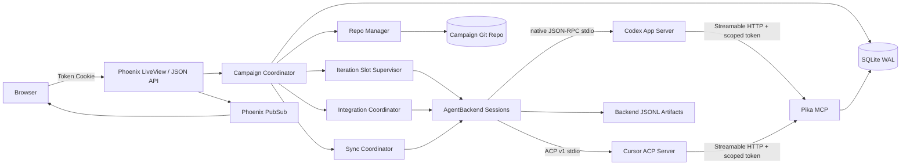
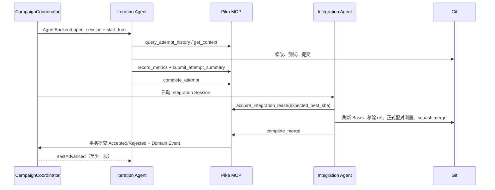

# Pika v1 架构

## 1. 部署单元

一个 Pika Server 恰好管理一个仓库的一次完整 Optimization Campaign。它拥有一个 Campaign Workspace、一个 SQLite 数据库、一个 Campaign Best Branch、一组 Iteration Slots、一个 HTTP Token 和一个 Phoenix Endpoint。再次优化同一仓库也会启动另一个 Pika Server。

```text
Pika Server
├── Campaign Workspace
│   ├── repo/                  # Managed Repo 软链接或 Pika 自建 repo
│   ├── attempts/              # 活跃 Attempt worktree
│   ├── artifacts/             # patch/profile/prompt/log/plan
│   ├── pika.sqlite3
│   └── config.json
├── Phoenix Endpoint           # LiveView、JSON API、HTTP MCP
├── Campaign supervision tree
└── Agent Backend subprocesses
```

## 2. 组件关系



## 3. OTP 监督树

```text
Pika.Application
├── Pika.Repo                         # Ecto SQLite
├── Phoenix.PubSub
├── PikaWeb.Endpoint
├── Pika.WorkspaceLock                # Managed Repo advisory lock
├── Pika.CampaignSupervisor
│   ├── Pika.CampaignCoordinator      # Campaign 状态与 dispatch gate
│   ├── Pika.RepoManager              # Git 事实核对，不代替 Agent merge
│   ├── Pika.ArtifactStore
│   ├── Pika.AgentBackendSessionSupervisor # DynamicSupervisor
│   ├── Pika.IterationSlotSupervisor  # 固定显式 Slots
│   ├── Pika.IntegrationCoordinator   # FIFO + Integration Lease
│   └── Pika.SyncCoordinator          # 人工触发
└── Pika.Telemetry
```

Backend Session 是独立受监督进程，内部通过 `Port` 启动 provider-specific 子进程。Codex Session 启动独立 `codex app-server --listen stdio://`，Cursor Session 启动独立 `cursor-agent acp`。Agent 崩溃只影响对应 Session；CampaignCoordinator 根据 SQLite 和 Git 事实启动恢复 Session。协议被封装在 `Pika.AgentBackend` Behaviour 后，领域代码不得依赖 Codex App Server 或 ACP wire types。

## 4. 核心职责

### CampaignCoordinator

- 执行 Campaign 状态机与停止条件。
- 为闲置 Iteration Slot 创建 Attempt，不超过 `max_attempts`。
- 处理 Pause、Stop、Resume、BestAdvanced 和 Spec Revision。
- 只在 SQLite 事务成功后广播 Domain Event。

### RepoManager

- 校验 Managed Repo 所有权、canonical path、clean 状态和实际 Git HEAD。
- 创建 setup/attempt/sync worktree 与分支。
- 在 Agent Git 操作后验证父提交、protected path、trailers 和实际 HEAD。
- 不替代编码 Agent解决冲突或执行 Merge。

### AgentBackendSession

- 通过 `Pika.AgentBackend` 打开 Session、自动批准权限，并注入 Pika HTTP MCP 与 Skill roots。
- 将 provider 原始消息顺序写入 JSONL，并把标准化 Backend Event 广播到 PubSub。
- Backend Turn 结束但缺少必需 MCP 调用时，在同一 Session 无限 follow-up。
- Attempt Guidance 调用统一 `steer`：Codex 映射到 `turn/steer`，Cursor 映射到 cancel + follow-up Prompt。
- Stop Now 调用统一 `interrupt`：Codex 映射到 `turn/interrupt`，Cursor 映射到 `session/cancel`。

`Pika.AgentBackend` 固定接口：

```elixir
start_link(profile, event_sink)
open_session(cwd, model, reasoning_effort, mcp, skill_roots)
start_turn(session, input)
steer(session, input)
interrupt(session)
close_session(session)
capabilities(session)
```

Codex adapter 通过 `initialize → initialized → thread/start → turn/start` 驱动 App Server，将 `item/*`、`turn/*` 通知转换为标准事件。Cursor adapter 驱动 ACP `initialize → session/new → session/prompt`，把 `session/update` 转换为同一事件集合。标准事件只表达会话、Turn、消息、Plan、工具、命令、文件、usage、完成与错误，不携带 provider wire struct。

Codex 每个 Session 通过进程级 config override 注入 Pika MCP URL、Bearer Token 环境变量和 `required=true`，并用 `skills/extraRoots/set`/`skills/list` 加载 Skill。Cursor 则通过 ACP Session 配置注入 MCP 与 Skill roots。

### IntegrationCoordinator

- FIFO 串行处理准备归并的 Attempt。
- 原子签发绑定 Backend Session 与进程的 Integration Lease。
- 检查陈旧 Base，要求 Agent刷新并重新进行正式配对测量。
- 在 Git mutation 前校验全量正确性、5 Pair Screening、异常组合的 Campaign Spec 正式 Pair 测量和 Full Regression Receipt。
- 回退候选拒绝并推进 Sampling Revision；通过候选才允许创建 Intent 和调用 `complete_merge`。
- 在 `complete_merge` 后联合核验 Receipt、SQLite Intent、Git 与全量 Metrics。

### SyncCoordinator

- 用户确认 remote、branch 和待 Push commit 后启动。
- 关闭新 Attempt dispatch，在临时 Sync Branch 上 merge、验证、push、推进 Best。
- 持久化 Sync Intent，支持“远端已成功、本地尚未推进”崩溃窗口恢复。

## 5. 数据权威

| 数据 | 权威来源 |
|---|---|
| 代码、分支、提交 | Git |
| Campaign/Attempt/Session 状态 | SQLite 当前状态表 |
| 最新结构化 Metrics | SQLite `attempt_metrics` / `best_metrics` |
| 状态时间线与待广播事实 | SQLite `domain_events` |
| Patch、Plan、Profiler、Prompt、Backend 原始输出 | Artifact Workspace |
| 实时 UI 更新 | Phoenix PubSub，非持久权威 |

恢复顺序固定为：SQLite 当前状态与 Operation Intent → Git 事实 → Artifact 完整性与 JSONL 尾部 → 重新启动所需 Agent。任何不可解释的不一致进入 Blocked，禁止危险推进。

## 6. Attempt 正常路径



## 7. 安全边界

HTTP Token 只保护单租户网站入口，不隔离本机 Agent。Agent 默认 YOLO 并被视为受信任进程；凭证来自进程环境，不能进入 Prompt、SQLite 或应用日志。Pika 通过 protected paths、正式 Harness、Git 核验和角色化 MCP 保护优化结果，但不承诺防御恶意 Agent 对主机的破坏。
