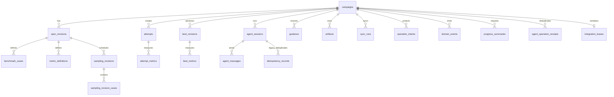

# Pika v1 SQLite Schema

## 1. 数据库策略

- Ecto migrations 管理 schema 版本。
- 启动连接设置 `foreign_keys=ON`、`journal_mode=WAL`、`synchronous=FULL`、`busy_timeout=5000`。
- 所有时间使用 UTC Unix microseconds；UI 再转换时区。
- 领域 ID 使用文本 UUID；用户可见 Attempt 序号、Spec Revision 和 Best Revision 另设递增整数。
- JSON 字段保存结构随 Spec 变化、但需要整体原子读取的对象；可查询和需要约束的字段必须规范化。
- SQLite 只存相对 Workspace 路径，禁止持久化可移动 Artifact 的绝对路径。

## 2. 表关系

## 3. 核心表

### `campaigns`

单例表，通过 `singleton_key INTEGER NOT NULL DEFAULT 1 CHECK(singleton_key=1) UNIQUE` 保证一个数据库只有一个 Campaign。

| 字段 | 类型 | 约束/说明 |
|---|---|---|
| `id` | TEXT | PK UUID |
| `singleton_key` | INTEGER | UNIQUE, CHECK 1 |
| `status` | TEXT | Campaign 状态 CHECK |
| `resume_state` | TEXT NULL | Paused/Stopped/Blocked 前状态 |
| `dispatch_gate` | TEXT NULL | `pause`, `sync`, `draining` 等 |
| `workspace_mode` | TEXT | `managed_repo`, `owned_repo` |
| `repo_relative_path` | TEXT | 通常为 `repo` |
| `managed_repo_canonical_path` | TEXT NULL | Managed Repo 身份 |
| `git_common_dir` | TEXT | 启动校验身份 |
| `base_sha` | TEXT | Campaign 初始化 HEAD |
| `best_branch` | TEXT | 固定 `pika/best` |
| `best_sha` | TEXT | 当前 Best |
| `current_spec_revision_id` | TEXT NULL | FK |
| `attempts_created` | INTEGER | 非负 |
| `max_attempts` | INTEGER NULL | NULL 表示只用目标停止 |
| `plan_enabled` | INTEGER | Boolean |
| `history_limit` | INTEGER | 默认 10 |
| `stop_mode` | TEXT | `all_goals`, `any_goal` |
| `config_hash` | TEXT | `config.json` SHA-256 |
| `lock_version` | INTEGER | 乐观锁 |
| `inserted_at`, `updated_at` | INTEGER | UTC μs |

### `spec_revisions`

| 字段 | 类型 | 约束/说明 |
|---|---|---|
| `id` | TEXT | PK |
| `campaign_id` | TEXT | FK |
| `revision` | INTEGER | UNIQUE(campaign_id, revision) |
| `status` | TEXT | `draft`, `awaiting_confirmation`, `confirmed`, `superseded`, `rejected` |
| `spec_json` | TEXT | 完整 Campaign Spec |
| `protected_paths_json` | TEXT | 路径清单 |
| `protected_digest` | TEXT | 路径+内容哈希 |
| `baseline_sha` | TEXT NULL | Baseline 对应 SHA |
| `target_snapshot_id` | TEXT NULL | FK，当前 Revision 使用的固定 Optimization Target |
| `development_baseline_sha` | TEXT NULL | 该 Revision 初始 Development / Best SHA |
| `implementation_manifest_json` | TEXT | Oracle、Target、Development 定义 |
| `reference_snapshot_json` | TEXT | 选中 Ref URL + full SHA |
| `skill_snapshot_json` | TEXT | Skill URL + full SHA |
| `confirmed_at` | INTEGER NULL | 用户确认时间 |
| `inserted_at`, `updated_at` | INTEGER | |

### `target_snapshots`

| 字段 | 类型 | 约束/说明 |
|---|---|---|
| `id` | TEXT | PK，内容身份 |
| `campaign_id` | TEXT | FK |
| `spec_revision_id` | TEXT | 创建该 Target 的 Spec Revision；后续 Revision 可继续引用同一行 |
| `source_kind` | TEXT | `development_snapshot`, `reference_project` |
| `source_reference_id` | TEXT NULL | 外部 Target 的 Reference Project ID |
| `source_sha`, `tree_sha` | TEXT | 固定源码身份 |
| `entrypoint` | TEXT | Target 入口文件 |
| `digest` | TEXT | 来源、入口和 tree 的完整 digest |
| `checkout_relative_path` | TEXT | `targets/<revision>/repo` |
| `inserted_at` | INTEGER | UTC μs |

### `benchmark_cases`

| 字段 | 类型 | 约束/说明 |
|---|---|---|
| `id` | TEXT | PK |
| `spec_revision_id` | TEXT | FK |
| `ordinal` | INTEGER | UNIQUE(spec_revision_id, ordinal) |
| `name` | TEXT | UNIQUE(spec_revision_id, name) |
| `kind` | TEXT | `target`, `guard`, `informational` |
| `shape_json` | TEXT | Shape 参数 |
| `dtype_json` | TEXT | 输入/输出 dtype |
| `layout_json` | TEXT | stride/layout |
| `distribution_json` | TEXT NULL | 输入分布 |
| `frequency_weight` | REAL NULL | 只用于排序/UI |

### `metric_definitions`

| 字段 | 类型 | 约束/说明 |
|---|---|---|
| `id` | TEXT | PK |
| `spec_revision_id` | TEXT | FK |
| `name` | TEXT | UNIQUE(spec_revision_id, name) |
| `unit` | TEXT | `us`, `tflops`, `bytes` 等 |
| `direction` | TEXT | `minimize`, `maximize` |
| `role` | TEXT | `target`, `guard`, `informational` |
| `min_improvement_ratio` | REAL | 默认 0.01 |
| `parser_json` | TEXT | Harness 输出解析契约 |

### `sampling_revisions`

| 字段 | 类型 | 约束/说明 |
|---|---|---|
| `id` | TEXT | PK |
| `campaign_id` | TEXT | FK |
| `spec_revision_id` | TEXT | FK |
| `sequence` | INTEGER | UNIQUE(campaign_id, spec_revision_id, sequence) |
| `cause` | TEXT | `baseline`, `regression_feedback` |
| `source_attempt_id` | TEXT NULL | 回退反馈来源 Attempt |
| `summary` | TEXT | 选择与成本摘要 |
| `created_at` | INTEGER | |

`sampling_revision_cases` 以 `(sampling_revision_id, benchmark_case_id)` 为主键，保存 `reason` 与可选 `evidence_json`。同一 Spec Revision 后一版本必须是前一版本的超集；初始版本最多十个 Case，反馈版本不受该上限限制。

## 4. Revision 与 Attempt

### `best_revisions`

| 字段 | 类型 | 约束/说明 |
|---|---|---|
| `id` | TEXT | PK |
| `campaign_id` | TEXT | FK |
| `sequence` | INTEGER | UNIQUE(campaign_id, sequence) |
| `sha` | TEXT | UNIQUE(campaign_id, sha) |
| `cause` | TEXT | `baseline`, `attempt`, `sync` |
| `attempt_id` | TEXT NULL | FK |
| `sync_run_id` | TEXT NULL | FK |
| `spec_revision_id` | TEXT | FK |
| `summary` | TEXT | BestAdvanced 摘要 |
| `inserted_at` | INTEGER | |

### `attempts`

| 字段 | 类型 | 约束/说明 |
|---|---|---|
| `id` | TEXT | PK |
| `campaign_id` | TEXT | FK |
| `ordinal` | INTEGER | UNIQUE(campaign_id, ordinal) |
| `spec_revision_id` | TEXT | FK |
| `slot_index` | INTEGER | 显式 Iteration Slot |
| `sampling_revision_id` | TEXT | Attempt 创建时固定的采样版本 FK |
| `status` | TEXT | Attempt 状态 CHECK |
| `resume_state` | TEXT NULL | Interrupted 前状态 |
| `base_sha` | TEXT | 创建/最近刷新 Base |
| `branch_name` | TEXT | UNIQUE |
| `worktree_relative_path` | TEXT | UNIQUE |
| `description` | TEXT NULL | 工作描述 |
| `summary` | TEXT NULL | 最新 Summary |
| `outcome_reason` | TEXT NULL | 拒绝/取消原因 |
| `patch_artifact_id` | TEXT NULL | FK |
| `accepted_sha` | TEXT NULL | squash SHA |
| `created_at`, `started_at`, `completed_at` | INTEGER NULL | |
| `lock_version` | INTEGER | 乐观锁 |

### `attempt_metrics`

主键为 `(attempt_id, benchmark_case_id, metric_definition_id)`；Integration Full Regression 使用 UPSERT 覆盖 Iteration 快照并补齐 Full Case Set。

| 字段 | 类型 | 说明 |
|---|---|---|
| `attempt_id` | TEXT | FK |
| `benchmark_case_id` | TEXT | FK |
| `metric_definition_id` | TEXT | FK |
| `measured_sha` | TEXT | 必须等于提交时验证 SHA |
| `value` | REAL | Development candidate 中位数 |
| `target_snapshot_id` | TEXT | FK，测量使用的固定 Target 身份 |
| `target_value` | REAL | 同轮 Target 中位数 |
| `target_relative_improvement` | REAL | Development 相对固定 Target，统一为正值更好 |
| `baseline_value` | REAL | 当时 current Best 的持久化值 |
| `best_relative_improvement` | REAL | Development 相对 current Best，统一为正值更好 |
| `improvement_ratio` | REAL | `best_relative_improvement` 的兼容字段 |
| `mad` | REAL | Pair ratio MAD |
| `noise_tolerance` | REAL | `max(0.005, 3*1.4826*MAD)` |
| `pair_count`, `valid_pair_count` | INTEGER | 用户在 Spec 中声明的正式数量 / 实际有效数量；必须达到用户声明的 `min_valid_pairs` |
| `source` | TEXT | `iteration`, `integration_screen`, `integration_full` |
| `measured_at` | INTEGER | |

`best_metrics` 使用同样字段，以 `(best_revision_id, benchmark_case_id, metric_definition_id)` 为主键；Accepted Best 必须由归并前全量回归提供完整 Case 覆盖。

## 5. Agent 与消息

### `agent_sessions`

包含 `id`（即 Pika Backend Session ID）、`campaign_id`、兼容字段 `attempt_id`/`sync_run_id`、`role`、`work_kind`、`work_id`、`role_contract_revision`、`session_mode`、`profile_json`、`backend`、`backend_protocol`、`backend_version`、`provider_session_id`、`backend_capabilities_json`、`model`、`reasoning_effort`、`status`、`process_pid`、`process_started_at`、`mcp_token_hash`、`log_artifact_id`、`required_operations_json`、`role_definition_sha256`、`template_sha256`、`instructions_sha256`、`instructions_artifact_id`、`last_turn_sequence`、`last_event_seq`、`started_at`、`ended_at`。

`work_kind + work_id + role` 标识 Session 执行的 Agent Work；同一 Work 可以留下多个按时间排序的 Session audit 行，但只有 Directory 中的一个 Actor/Token 可以活动。`session_mode` 为 `fresh` 或 `recovering`。`provider_session_id` 仅审计 Codex thread ID 或 Cursor ACP session ID；服务恢复总是根据 committed domain facts 创建全新 provider Session，不把该字段作为 resume/load 输入。Backend 原始消息写 JSONL，最终 Agent Instructions 另存 Artifact，并以三个 SHA 字段记录 Role、模板和最终文本身份。

明文 MCP Token 不持久化。PID 只用于诊断和同进程监控，不能独立证明进程身份。

### `agent_operation_receipts`

主键为 `(campaign_id, role, work_kind, work_id, operation, idempotency_key)`，另存 `request_sha256`、`response_json` 与 `created_at`。同一 Work 替换 Actor、Backend Session 或 Token 后，重复的同请求返回已提交响应；同 key 不同请求返回冲突。旧 `idempotency_records` 继续保留给 legacy adapter 读取，但新 Role command 不以 Session ID 作为幂等身份。

### `progress_summaries`

每个可选定时汇总先写入一条 Request，包含 `id`、`campaign_id`、捕获时的 `phase`、`attempt_ids_json`、不可变 `context_json`、Backend/模型/reasoning effort、`status` (`requested`, `running`, `completed`, `failed`)、结果 `content`、失败原因与各时间戳。部分唯一索引保证每个 Campaign 同时至多一个 `requested`/`running` Request。旧版已完成 Summary 行通过默认值继续可读。

### `agent_messages`

包含自增 `sequence`、UUID `id`、`campaign_id`、`from_session_id`、`to_session_id`、`scope`、`body`、`priority`、`status`、`created_at`、`delivered_at`、`acknowledged_at`。索引 `(to_session_id, status, sequence)` 支持 Mailbox 顺序读取。

### `guidance`

包含自增 `sequence`、`kind` (`campaign`, `attempt`, `side`)、可选 `attempt_id`、父 BTW Conversation/Session、`body`、`status`、`created_at`。Campaign Guidance 和未读 Attempt Guidance 注入 Prompt；Side Conversation 不注入。

## 6. Artifact、Sync 与事务

### `artifacts`

包含 `id`、`campaign_id`、`owner_type`、`owner_id`、`kind`、`relative_path`、`sha256`、`byte_size`、`mime_type`、`metadata_json`、`created_at`。`relative_path` 唯一，必须通过规范化检查禁止 `..` 和逃逸 Workspace。

### `sync_runs`

包含 `id`、`campaign_id`、`status`、`remote`、`branch`、`base_sha`、`remote_before_sha`、`candidate_sha`、`remote_after_sha`、`best_after_sha`、`summary`、`trail_artifact_id`、`started_at`、`completed_at`。

### `operation_intents`

包含 `id`、`campaign_id`、`kind` (`merge`, `sync`, `cleanup`)、`owner_type/id`、`state` (`pending`, `applied`, `verified`, `aborted`)、`expected_best_sha`、`target_sha`、`idempotency_key`、`payload_json`、`created_at`、`updated_at`。`idempotency_key` 唯一。

### `integration_leases`

单例表，字段为 `singleton_key=1`、`campaign_id`、`backend_session_id`、`attempt_id`、`intent_id`、`expected_best_sha`、`acquired_at`。没有过期时间。只有验证/恢复事务可以删除。

### `domain_events`

自增 `sequence` 为 UI/订阅顺序，另有唯一 UUID `event_id`、`aggregate_type/id`、`event_type`、`payload_json`、`created_at`。Payload 可以保存 Attempt ID、SHA、状态和 Delta，但不保存被覆盖的旧 Metric 快照。

### `idempotency_records`（legacy）

主键 `(backend_session_id, tool_name, idempotency_key)`，保存旧 MCP adapter 的 `request_sha256`、`response_json`、`created_at`。它用于滚动迁移与旧 Workspace 恢复；统一 Role Runtime 的命令改用 `agent_operation_receipts`。

## 7. 必要索引与约束

- `attempts(campaign_id, status, ordinal)`：调度和时间线。
- `agent_sessions(status, role)`、`agent_sessions(attempt_id, status)` 与 `agent_sessions(campaign_id, role, work_kind, work_id, status)`：恢复扫描和 Work 历史。
- `domain_events(sequence)`、`domain_events(aggregate_type, aggregate_id, sequence)`。
- `artifacts(owner_type, owner_id, kind)`。
- `sync_runs(status, started_at)`。
- 所有状态字段使用 CHECK constraint；所有计数非负；SHA 为 40/64 位十六进制 CHECK。
- `accepted` Attempt 必须有 `accepted_sha`、Patch、Summary 和 Metrics；`rejected` 必须有 `outcome_reason`。跨字段规则在 Ecto changeset 与事务函数中双重验证。

## 8. 迁移与备份

- Release 启动前运行只向前 migration；失败则不启动 Endpoint 和 Agent。
- 不支持自动 downgrade；恢复旧版本前使用 Workspace 备份。
- 备份必须一致地包含 SQLite checkpoint、`config.json`、repo Git 数据和 Artifact Workspace。
- Schema migration 不能修改外部 Git 或远端状态；外部操作只由带 Intent 的运行时事务触发。
