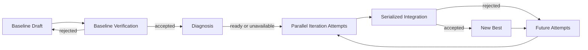

# KDA-Inspired Agent Polish

Status: proposed design, 2026-08-31.

This design improves Pika's optimization intelligence without replacing its
transactional control plane. It adopts KDA's profile-first workflow,
artifact-first memory, and durable experiment notebook. It deliberately keeps
one configured Agent per Role: heterogeneous actor alternation and Flame Chase
turn scheduling are outside this change.

The current Pika design remains authoritative unless this directory explicitly
defines a flow-v2 difference. In particular, independent Attempt worktrees,
the monotonic Iteration Case Set, serialized full-case Integration, immutable
Baseline contracts, scoped Git intents, and fresh-Session recovery remain
unchanged.

## 1. Motivation

Pika currently has a strong verification and recovery loop but a weak
exploration loop:

- an Iteration Agent is told to form a hypothesis before Pika has produced a
  shared profiler diagnosis;
- the durable cross-Round memory is primarily a complete conversation journal
  plus free-form summaries;
- intermediate experiments have no first-class identity, checkpoint, or
  machine-readable result;
- every configured coding Role relies on whatever kernel knowledge happens to
  exist in the provider's global environment.

KDA v0.5 combines domain skills, profiling, and a repository-backed experiment
loop. The useful principle for Pika is not the number of Agents. It is that an
optimization should start from measured evidence, and that later work should
inherit validated artifacts rather than another Agent's speculative reasoning.

Primary references:

- [KDA v0.5 announcement](https://x.com/LigengZhu/status/2094144663490048105)
- [KDA contest kernels and reproduction](https://github.com/mit-han-lab/mlsys2026-flashinfer-contest-solution)
- [Humanize2 Flame Chase](https://docs.humanfia.ai/humanize2/flows/flame-chase)
- [Latest KernelWiki, `master`](https://github.com/mit-han-lab/KernelWiki/tree/master)
- [Latest ncu-report-skill, `main`](https://github.com/mit-han-lab/ncu-report-skill/tree/main)
- [Codex local skill discovery](https://developers.openai.com/codex/build-skills)
- [Cursor Agent Plugins](https://cursor.com/docs/plugins)

## 2. Accepted decisions

1. Pika introduces flow version 2. Existing flow-v1 Optimizations finish under
   their original contracts; upgrades do not insert new Work into an active
   flow.
2. Baseline acceptance seeds the initial Iteration Case Set as today, then
   schedules one Diagnosis Work before any Iteration Work.
3. Diagnosis reuses the configured Iteration Agent. It is a distinct Role and
   prompt, not a new Agent configuration choice.
4. Every Candidate must name a durable, locally kept Experiment recorded by a
   non-terminal MCP operation. Rejected Attempts may terminate without an
   Experiment when no meaningful experiment could run.
5. New Iteration Sessions consume Diagnosis and Experiment artifacts before
   historical transcripts. Complete transcripts remain retained for audit and
   current-Work recovery.
6. At Optimization initialization, Pika independently resolves the current
   remote heads of KernelWiki `master` and ncu-report-skill `main`, clones those
   exact revisions, validates them, and freezes them for the Optimization.
   Pika never uses the versions pinned inside `kernel-design-agents`.
7. The frozen skills are injected into Baseline Draft, Baseline Verification,
   Diagnosis, Iteration, and Integration Sessions. Follow-up generators do not
   receive them.
8. Skill acquisition is a required initialization prerequisite. A missing,
   invalid, or partially fetched skill snapshot fails initialization before a
   Baseline Agent starts.
9. Provider injection is Session-scoped. Codex receives reserved repo-local
   discovery links and Cursor receives a local Agent Plugin; neither provider
   gets a user-global skill installation.

## 3. Flow v2

Diagnosis is a one-time stage for an accepted Baseline Revision. Later
Experiments may add new profiling evidence, but flow v2 does not automatically
schedule another global Diagnosis after each Best update. That avoids turning
profiling into a serial bottleneck; a future design may add an explicit
re-diagnosis trigger based on measured stagnation.

## 4. Documents

- [Architecture](architecture.md) defines the new Modules, state flow, skill
  snapshot lifecycle, provider injection, and recovery behavior.
- [Contracts](contracts.md) defines the Diagnosis, Experiment, knowledge, MCP,
  Context Bundle, and storage interfaces.
- [Work breakdown](work-breakdown.md) divides implementation into ordered,
  independently reviewable work packages with completion criteria.

## 5. Non-goals

- Alternating two Agents or models inside one Attempt.
- Assigning different hypotheses to coordinated multi-Agent lanes.
- Replacing the configured Iteration concurrency or FIFO Integration policy.
- Mutating KernelWiki from one Optimization's local results.
- Publishing local Experiment knowledge to an external service.
- Installing skills into user-global Codex or Cursor directories.
- Treating profiler output, an Agent statement, or an Iteration result as an
  accepted performance claim before full Integration.

## 6. Success criteria

The design is complete when a flow-v2 Optimization can prove all of the
following:

- every coding Session reports the same frozen skill source commits;
- Iteration starts with a durable Diagnosis result or an explicit profiler
  unavailability record;
- every Candidate is the clean checkpoint of a recorded kept Experiment;
- a new Iteration Agent can reconstruct measured progress from structured
  artifacts without reading old speculative conversations;
- Integration remains the only operation that advances Best or marks a local
  improvement as verified;
- a flow-v1 Workspace can be upgraded and resumed without adopting any flow-v2
  requirement mid-run.
