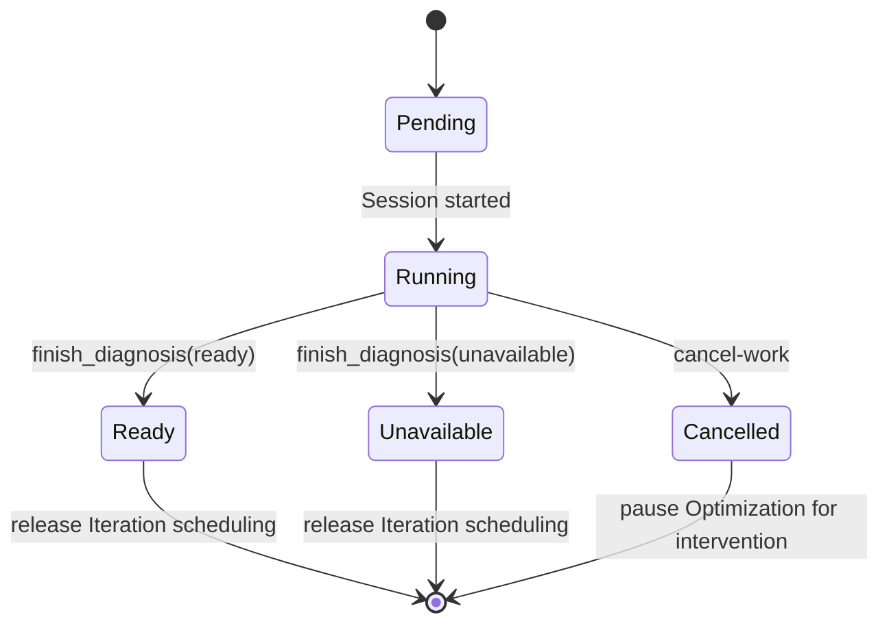

# Architecture

This document is the single source of truth for the flow-v2 topology and the
new Module interfaces. JSON and MCP field contracts live in
[contracts.md](contracts.md).

## 1. Invariants

Flow v2 adds intelligence before and within Iteration while preserving these
control-plane invariants:

- SQLite domain state and terminal MCP operations remain authoritative.
- Herdr and provider processes remain runtime observations, not completion
  signals.
- Diagnosis cannot modify the source repository, Best, Baseline Definition, or
  benchmark harness.
- Iteration may mutate only its assigned Round worktree; Integration remains
  the sole path to Best.
- The Full Case Set remains required for Baseline Verification and Integration.
- The Iteration Case Set still begins with at most ten deterministic Cases and
  grows only through the existing integration-regression rule.
- A skill is advice and tooling. It cannot expand a Role grant, override a
  frozen Context Bundle, or weaken an MCP postcondition.

## 2. Module map

```text
Initialization
    |
    v
SkillSnapshotManager --------------> immutable SkillSnapshot
                                             |
                                             v
Activation Preparer ---> Provider Adapter ---> Codex / Cursor argv
         |
         +----> frozen Role prompt + Context Bundle

Baseline Verification accepted
         |
         v
Diagnosis Projector ---> Diagnosis Agent ---> finish_diagnosis
         |                                      |
         +---------------- Diagnosis Store <----+
                                |
                                v
Iteration Projector ---> Experiment Ledger ---> Knowledge Projection
         |                       ^                      |
         v                       |                      v
Iteration Agent --- record_iteration_experiment --> Context Bundle v4
         |
         +--- finish_iteration(candidate) ---> Integration
```

### 2.1 `SkillSnapshotManager`

`SkillSnapshotManager` is a deep Module. Its Interface is intentionally one
operation:

```go
Prepare(ctx context.Context, request SkillSnapshotRequest) (SkillSnapshot, error)
```

The caller supplies the Optimization Workspace and immutable source
descriptors. The Module owns remote resolution, clone staging, validation,
provenance, atomic publication, restart reuse, and corruption detection. The
caller learns only the published snapshot identity and provider-neutral skill
references.

Deleting this Module would spread Git, filesystem safety, provenance, retry,
and validation logic across initialization and both Provider Adapters. Keeping
that behavior behind one Interface provides leverage and locality.

`SkillSnapshot` contains:

- snapshot ID and absolute plugin root;
- the two skill names and absolute directories;
- requested repository URL and branch for each skill;
- resolved commit SHA and a deterministic content digest;
- publication time and validation version.

The Module has internal seams for remote Git execution and filesystem
publication so tests can use fake remotes without weakening the production
Interface.

### 2.2 Provider Adapter seam

`SessionActivation` gains a provider-neutral list of frozen skill references.
Codex and Cursor are the two real Adapters at the existing provider seam:

- the Codex Adapter mounts the two skill directories through reserved,
  repo-local `.agents/skills` discovery links for the Session;
- the Cursor Adapter adds one invocation-scoped `--plugin-dir` pointing at the
  snapshot root.

Provider-specific syntax stays inside the Adapters. Role scheduling,
activation preparation, and Context generation never branch on Codex versus
Cursor.

### 2.3 Diagnosis Module

The Diagnosis Module owns one accepted Baseline's profiler diagnosis. Its
Interface is the `finish_diagnosis` command and the resulting immutable
projection. It hides report validation, evidence artifact receipts, repository
postconditions, and successor Iteration scheduling.

Diagnosis uses a distinct Role System Prompt and MCP catalog but the same Agent
configuration selected for Iteration. This preserves the user's single-Agent
choice while giving profiling an explicit completion contract.

### 2.4 Experiment Ledger Module

The Experiment Ledger owns the ordered record of concrete Iteration
experiments. Its Interface is `record_iteration_experiment` plus read-only
projections consumed by Context generation and `finish_iteration` validation.

The Module serializes records within an Iteration Round, tracks the current
kept checkpoint, verifies Git and evidence postconditions, and projects
knowledge confidence. Agent prompts do not reimplement these rules.

## 3. Skill snapshot lifecycle

### 3.1 Sources

Pika uses two independent source descriptors:

| Skill | Repository | Branch |
| --- | --- | --- |
| `KernelWiki` | `https://github.com/mit-han-lab/KernelWiki.git` | `master` |
| `ncu-report-skill` | `https://github.com/mit-han-lab/ncu-report-skill.git` | `main` |

“Latest” means the branch head resolved during this Optimization's
initialization. Once both commits are recorded, the Optimization is pinned to
those commits. Daemon restart, Session recovery, Back-off, and later Iteration
Rounds reuse the same snapshot without network access.

### 3.2 Layout

The manager publishes one standard Agent Plugin:

```text
<workspace>/toolkits/kda-skills/<snapshot-id>/
  plugin.json
  pika-snapshot.json
  skills/
    KernelWiki/
      .git/
      SKILL.md
      ...
    ncu-report-skill/
      .git/
      SKILL.md
      ...
```

The checkout directories are the skill directories. No copy or symlink is
needed, so relative resources referenced by each `SKILL.md` keep working for
both providers.

`plugin.json` follows the Agent Plugins schema and declares only the plugin's
identity. Cursor discovers the two skills from `skills/`. `pika-snapshot.json`
is Pika-owned provenance and is not an Agent instruction.

### 3.3 Acquisition transaction

Initialization performs the following sequence before committing the
Optimization or scheduling Baseline Draft:

1. Resolve both configured branch heads from the allowlisted HTTPS remotes.
2. Create a user-only staging directory under the Workspace toolkit root.
3. Initialize each checkout, depth-1 fetch the resolved SHA, and detach
   `FETCH_HEAD` into its exact skill directory.
4. Validate source identity, commit identity, required files, safe paths, and
   supported skill metadata.
5. Allow only relative symlinks resolving inside the skill root. Reject
   absolute, escaping, circular, or `.git`-resolving links, nested `.git`,
   provider control manifests, and additional/nested `SKILL.md` files.
6. Generate strict `plugin.json` and `pika-snapshot.json` with
   `validation_version`, then compute the snapshot digest.
7. Make the published content read-only and atomically rename staging to the
   digest-addressed final directory.
8. Return the frozen `SkillSnapshot` to initialization.

Any failure removes staging and fails initialization. Pika does not start a
Baseline Agent with one skill, an unfrozen branch, or a warning-only fallback.
A final directory that already exists is reused only after complete identity
and digest validation. If durable Init later fails, only a snapshot newly
published by that request is verified and removed; a reused publication remains.

### 3.4 Activation validation

Before every coding Session, activation verifies the stored snapshot manifest,
the two commit identities, and tracked cleanliness. A mismatch blocks the
Session and surfaces a recoverable corruption diagnostic. Activation never
fetches or repairs from the network; repair is an explicit operator action so a
running Optimization cannot silently change knowledge versions.

### 3.5 Trust model

Following `main` and `master` intentionally trusts those upstream branches at
Optimization initialization. Pika limits the blast radius:

- repository URLs and branch names are product-owned constants in flow v2;
- resolved commits and content digests are durable facts;
- only the two validated skill roots are injected;
- KDA's top-level instructions, hooks, MCP definitions, and provider profiles
  are never loaded;
- Pika Role prompts explicitly state that Role grants, frozen targets,
  benchmark protocols, and terminal MCP rules outrank skill instructions;
- skill scripts run under the same Session sandbox and approval policy as
  ordinary Agent commands.

The snapshot is evidence about what was used, not an endorsement that every
upstream performance claim applies to the current hardware or workload.

## 4. Provider injection

### 4.1 Codex

Codex discovers local skills only from repository, user, admin, system, or
installed-plugin locations. Its `skills.config` entries are enablement
overrides for already discovered skills, so they are not an injection
mechanism.

Before a coding Session, the Codex Adapter creates two reserved symbolic links
under the Work repository:

```text
<repository>/.agents/skills/
  pika-kda-kernelwiki -> <snapshot>/skills/KernelWiki
  pika-kda-ncu-report -> <snapshot>/skills/ncu-report-skill
```

The Work repository is a Pika-owned clone or worktree. Workspace creation adds
exact patterns for those two reserved paths to the repository-local Git exclude
file, so the links never enter Candidate state or contaminate cleanliness
checks. The Adapter refuses a tracked path, a pre-existing non-owned entry, or
a link with the wrong target. It creates links by atomic rename, validates what
Codex will see, records an explicit Session/snapshot ownership receipt, and
returns cleanup that requires the unchanged receipt and unchanged targets;
empty parent directories are removed only when Pika created them. Symlinked
parents are rejected and existing directory modes are preserved. Crash
recovery applies the same ownership checks before replacing stale links.

Codex still launches at the Work repository root, so Git and build behavior do
not change. Ordinary user, repository, admin, system, and plugin skills remain
discoverable. Pika does not write `~/.agents/skills`, `$CODEX_HOME/config.toml`,
or the Pika-managed profile to add Optimization-specific paths. The existing
managed profile remains responsible only for hooks, MCP, and stable Pika
integration.

When Codex is selected by a coding Role, initialization runs `codex debug
prompt-input` in an isolated repository. It parses the real JSON message array,
locates the unique developer `skills_instructions`, resolves root aliases and
file references, and requires `KernelWiki` and `ncu-report-skill` to map
one-to-one to the mounted absolute `SKILL.md` paths. Missing, duplicate,
ambiguous, or mismatched records fail before durable Init. Follow-up-only Codex
receives the generic availability probe without this coding-specific gate.

### 4.2 Cursor

The snapshot root is already a standard Agent Plugin. For every coding Session,
the Cursor Adapter appends:

```text
--plugin-dir <absolute-snapshot-root>
```

The argument is additive to any user-supplied allowed plugin directories.
Pika does not copy the plugin under `~/.cursor/plugins`, edit Cursor marketplace
state, or require persistent local-plugin installation. Existing reserved-argv
validation prevents a Role configuration from supplying a conflicting
Pika-owned plugin directory.

When Cursor is selected by a coding Role, initialization uses
`--plugin-dir ROOT --help` only as a non-model option-support probe. Pika's
strict local validator separately proves the generated manifest and that its
discovery surface contains exactly two root skills. Follow-up-only Cursor does
not run this coding-specific gate.

### 4.3 Role scope

| Role | Skills injected | Reason |
| --- | --- | --- |
| Baseline Draft | yes | define realistic profiling and measurement artifacts |
| Baseline Verification | yes | verify environment and profiling assumptions |
| Diagnosis | yes | profile, diagnose, and create hypotheses |
| Iteration | yes | query techniques and interpret new profiles |
| Integration | yes | independently inspect profiler-backed claims |
| Follow-up | no | generate a message from target facts, not perform domain work |

Each Context Bundle records the snapshot identity and the two skill references,
so an Agent can report what it used even when provider-native skill telemetry is
unavailable.

## 5. Diagnosis lifecycle

Baseline acceptance still creates Best revision 0 and seeds the initial
Iteration Case Set. Flow v2 then projects one Diagnosis Work for that accepted
Baseline Revision. Iteration projection remains blocked until Diagnosis is
terminal.



Diagnosis receives:

- the accepted Baseline Definition and Repository Snapshot SHA;
- Best revision 0;
- the initial Iteration Case Set;
- an empty, Work-owned evidence directory;
- the frozen skill snapshot;
- a Role catalog containing only `finish_diagnosis`.

It may run benchmarks, construct a standalone profiler harness under its
evidence directory, and collect profiler reports. It may not edit or commit the
source repository. `finish_diagnosis` verifies that source HEAD and cleanliness
still match the accepted snapshot.

`ready` means the Agent produced profiler-backed observations and a ranked
hypothesis queue. `unavailable` is reserved for factual hardware, permission,
tool, build, or profiler limitations. It still records attempted commands,
failures, static observations, and any lower-confidence fallback hypotheses.
Missing skills are never represented as `unavailable`; they are an
initialization failure.

Diagnosis is Follow-up eligible under a target-specific prompt. Exhausting its
Follow-up policy pauses the Optimization rather than fabricating an unavailable
result.

## 6. Experiment ratchet

An Iteration Round begins at a stored current checkpoint: initially its Base
SHA, later the newest kept Experiment checkpoint in that Round. The Agent may
perform multiple experiments in one Session.

For each experiment:

1. Select a Diagnosis hypothesis or define a new inline hypothesis.
2. Record the parent checkpoint and pre-change measurements.
3. Make one coherent change and run the frozen Iteration Case Set.
4. Write raw results under the protected `iteration_context.evidence_root`,
   outside the source worktree.
5. Restore the worktree to the parent checkpoint when the result is rejected or
   inconclusive.
6. For a kept result, commit through `commit_changes`, leaving a clean worktree.
7. Call `record_iteration_experiment`; only its successful receipt advances the
   Round's current checkpoint.

The control plane validates the ratchet. A kept Experiment cannot point
sideways or backward, and a negative Experiment cannot leave unrecorded source
changes. The Agent may continue from a kept checkpoint or submit it as the
Candidate. `finish_iteration(candidate)` succeeds only when it names a kept
Experiment whose checkpoint equals the Candidate SHA and the Round's current
checkpoint.

## 7. Artifact-first memory

Context Bundle v4 preserves raw history but changes the default information
hierarchy:

1. current domain facts and terminal operation;
2. frozen skills, Diagnosis, and structured knowledge;
3. current Round experiments;
4. current Work conversation for recovery;
5. prior Round and terminal Attempt transcripts as on-demand references.

A fresh replacement Session for the same Work must read its current Work
conversation because it is recovering an unfinished action. A new Round or new
Attempt starts from artifacts; it reads historical transcripts only when a
specific knowledge record requires deeper audit. This separates operational
recovery from exploratory inheritance.

## 8. Compatibility and recovery

`optimizations.flow_version` freezes behavior:

- migrated rows default to flow version 1;
- new Optimizations use flow version 2;
- Work projection, tool catalogs, Context schemas, and terminal validation
  dispatch by the frozen flow version;
- a flow-v1 Optimization never receives Diagnosis Work or an Experiment
  requirement;
- frozen Context Bundle v3 files remain valid and are never rewritten;
- a flow-v2 daemon restart reuses the skill snapshot and reconstructs pending
  Diagnosis/Experiment state solely from SQLite and verified files.

The change requires no new user configuration. Diagnosis uses the Iteration
Agent configuration, and the skill source repositories and branches are
flow-v2 product behavior.
