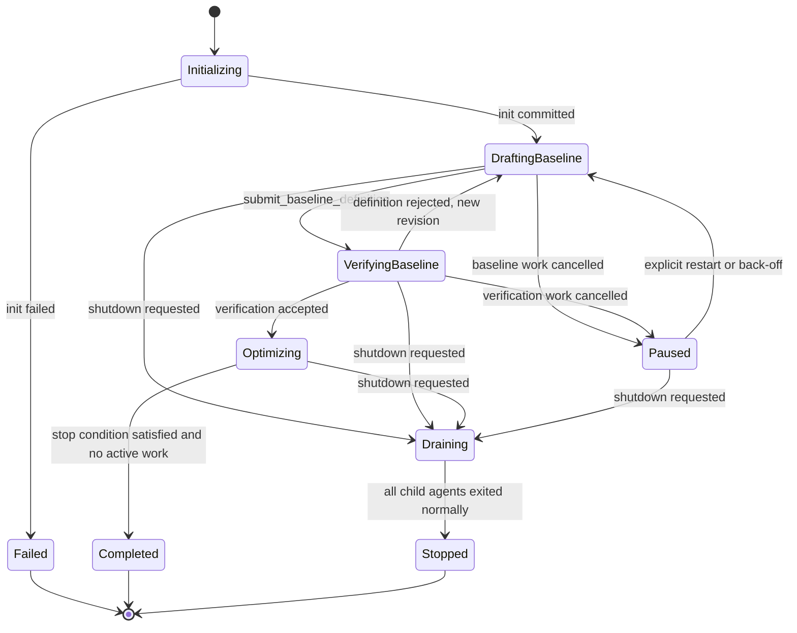
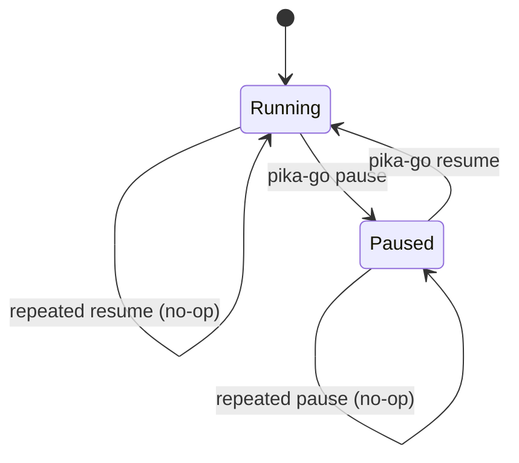
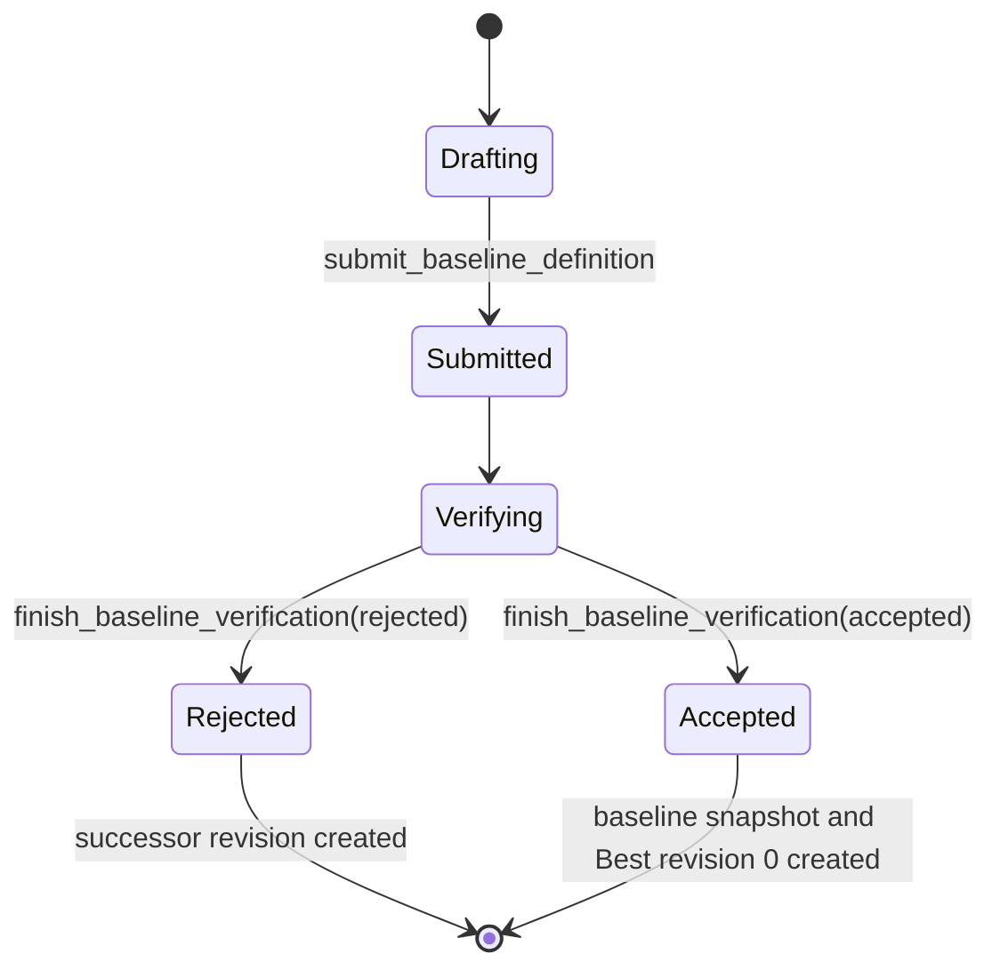
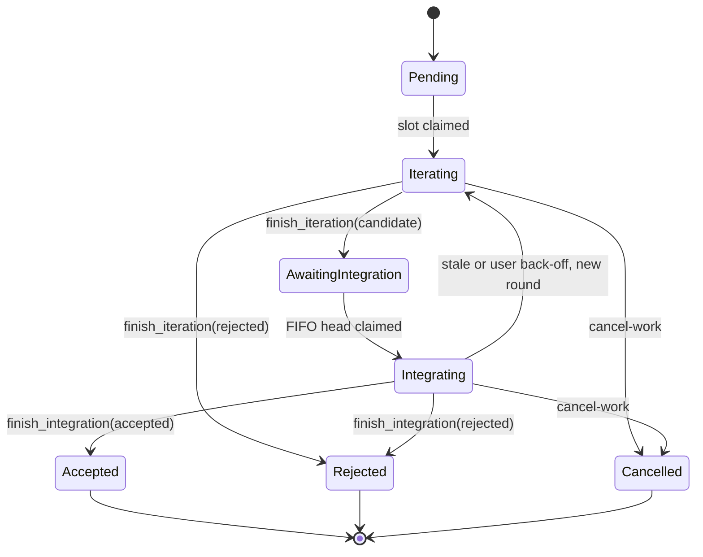
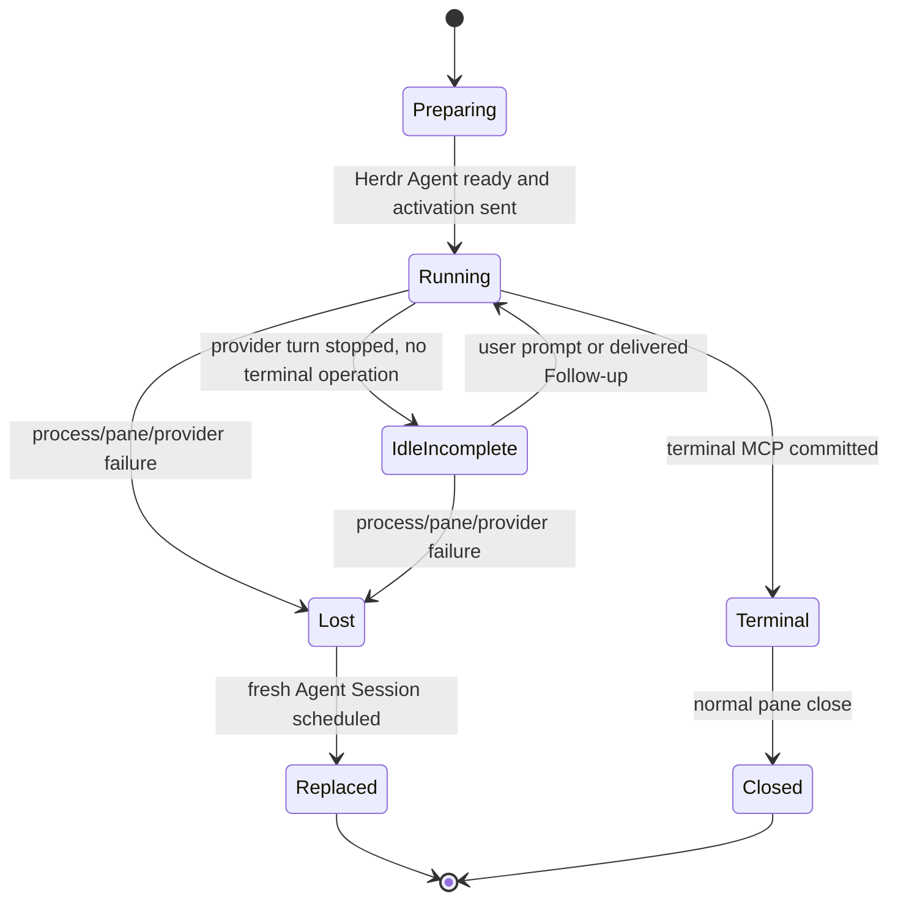
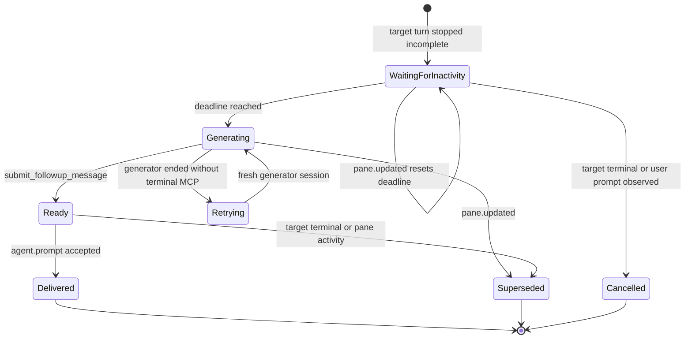

# State Machines

All transitions below are committed in SQLite before runtime effects are dispatched. A runtime effect may be retried or reconciled; a domain transition is replayed only through its idempotency receipt.

## 1. Optimization



`Optimizing` contains parallel Iteration Work and one serial Integration queue. An Optimization is not failed merely because one Attempt is rejected or cancelled.

Scheduler state is orthogonal to the Optimization lifecycle:



Pause commits before its high-priority Session interrupt cycle and prevents later start or Follow-up delivery effects from being claimed. Resume sends `继续` to surviving pending-Work Sessions before releasing held effects. Neither transition completes, cancels, replaces, or otherwise advances Work. Waiting Follow-up deadlines shift by only the time since the latest of Scheduler pause, request creation, or observed pane activity; a waiting request for a resumed target is superseded.

## 2. Baseline Revision



Rules:

- A submitted Baseline Revision is immutable.
- Verification is a fresh Agent Session with a distinct immutable Role System Prompt and a separate user-instruction overlay.
- Rejection records failure kind, reason, requested changes, and evidence, then automatically schedules a new draft revision whose runtime projection exposes those predecessor facts.
- Baseline Revision is the durable Definition identity. Draft and Verification Work/Session IDs are deliberately distinct execution identities and are not compared for Definition validity.
- Submission freezes the Definition bytes/digest and a separate clean Repository Snapshot SHA; a Definition is never required to contain the commit that contains itself.
- Verification establishes Development Baseline measurements; improvement gates and stop conditions apply to later Candidates, not to the Development Baseline relative to itself.
- Acceptance requires unchanged HEAD plus a clean worktree, creates Best revision 0 from the frozen Repository Snapshot, and freezes the case/metric/evidence contract used by Attempts.

## 3. Attempt and Iteration Round



Rules:

- Attempt identity survives stale Integration and Back-off; each new execution is an immutable Iteration Round.
- Iteration Rounds may run concurrently across Attempts.
- Integration is FIFO and single-concurrency.
- A stale Round merges the current Best into its workspace and remeasures; it is not rebased or silently replaced.
- Rejected history remains context, not a permanent ban on a technique.

## 4. Integration and Best mutation

Integration is a three-step protocol with two durable domain mutations around one idempotent Git application:

```text
get_context
    ↓
full correctness/performance evidence
    ↓
prepare_best_update
    ├── rejected: no Git mutation intent
    └── intent issued
            ↓
        apply_best_update
            ↓
        finish_integration
            ├── accepted: verify Git and advance Best atomically
            └── rejected: preserve evidence, do not advance Best
```

Only `finish_integration(accepted)` after Git postcondition verification changes Best. Pika never pushes or modifies a user source branch.

## 5. Agent Session



Herdr `working`, `blocked`, `idle`, `done`, and `unknown` are observations attached to these states, not substitutes for them.

A daemon process restart treats every persisted `Preparing`, `Running`, or `IdleIncomplete` Session as `Lost`, even if Herdr still reports its process. The old Pika-owned pane is closed through an ordered runtime effect before the replacement start effect. Provider-native session identity is journal evidence only and is never a resume key.

## 6. Follow-up Request



Generator retry and target Follow-up counts are separate and durable. Exhaustion effects are Role-specific:

- Baseline Verification exhaustion fails/pauses the Optimization for intervention.
- Iteration exhaustion rejects the Attempt.
- Integration exhaustion rejects the Attempt without updating Best.

## 7. Back-off

Back-off never mutates a completed record back into an earlier status.

| Current phase | Allowed result |
| --- | --- |
| Baseline Verification | reject/supersede current verification and create a new Baseline Revision |
| Integration | preserve the Integration result and create a new Iteration Round for the same Attempt |
| Other phases | rejected unless a transition is explicitly added to this table |

The supplied `-m` message is persisted and included in the successor Context Bundle.

## 8. Cancellation and shutdown

`cancel-work` is a Work transition and may close the selected Work's pane. `shutdown` is an Optimization transition and never cancels or kills active children.

Shutdown is rejected while Scheduler state is `Paused`, and Scheduler control is rejected while Optimization state is `Draining`.

The daemon's drain barrier is stricter than “no visible child pane”: it requires no pending Work, no pending or dispatching runtime effect, and no starting or running Agent Session. A recorder-only or damaged runtime may therefore remain draining indefinitely. When the barrier becomes true, the daemon stops accepting control requests, removes its Unix socket, and exits normally.

During `Draining`:

- no new Baseline, Verification, Iteration, or Integration Work starts;
- existing Work remains authorized to call MCP;
- Follow-up generation remains allowed for active incomplete Work;
- normal terminal completion closes the associated Agent;
- the daemon exits after the final child exits and persistence flush succeeds.
