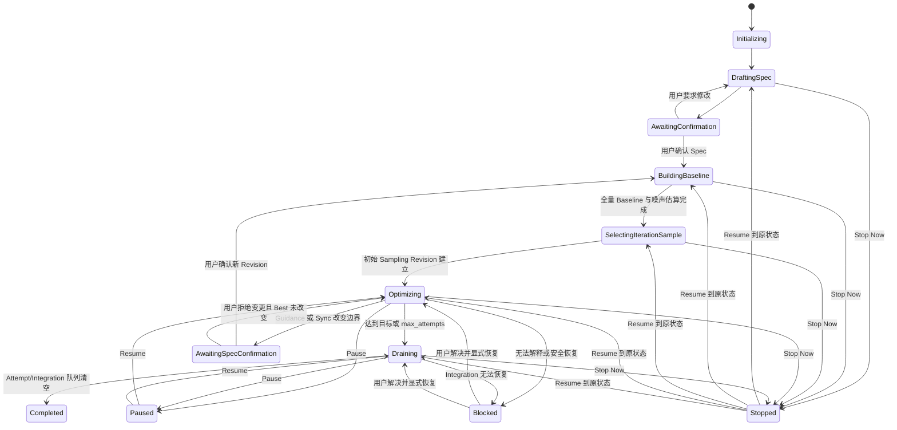

# Pika v1 状态机

## 1. Campaign 状态



`DraftingSpec` 只表示 Campaign 正在等待或形成 Spec 草稿，不等于 Backend Turn 已启动。Pika 可以提前打开并注入 Agent Instructions，但首个 Turn 必须等待用户消息完成 Campaign Kick-off；`AwaitingConfirmation → BuildingBaseline` 的用户确认动作同时授权 setup merge 与后续 Baseline Session。

`Paused` 不取消在途 Agent 或 Integration，只关闭新 Attempt dispatch。`Stopped` 会调用 `AgentBackend.interrupt` 终止活跃 Backend Turn，关闭自动恢复和归并，但保留全部状态。为正确 Resume，Campaign 表保存 `resume_state`。

Sync 不替换 Campaign 主状态，而设置 `dispatch_gate=sync`。这允许已有 Iteration 继续工作，同时禁止派生新 Attempt。UI 可以将其显示为 `Optimizing · Syncing`。

## 2. Attempt 状态

| 状态 | 含义 | 允许的下一个状态 |
|---|---|---|
| `queued` | 已占用 Attempt 序号，等待 Slot | `running`, `cancelled` |
| `running` | Iteration Agent 正在工作 | `awaiting_report`, `interrupted`, `cancelled` |
| `awaiting_report` | Backend Turn 已结束但缺少必需 MCP 调用 | `running`, `interrupted`, `cancelled` |
| `ready_for_integration` | 代码、Summary 和正式 Metrics 已提交 | `refreshing`, `integrating`, `rejected` |
| `refreshing` | Base 陈旧，Agent 正在 rebase/重测 | `ready_for_integration`, `rejected`, `interrupted` |
| `integrating` | 持有 Integration Lease | `accepted`, `rejected`, `interrupted` |
| `interrupted` | Session/进程消失但工作可恢复 | 恢复到中断前非终态 |
| `accepted` | squash commit 已核验并推进 Best | 终态 |
| `rejected` | 正确性、性能、protected path 或测量门禁失败 | 终态 |
| `cancelled` | 用户 Stop 或显式取消 | 终态，可保留 worktree |

`awaiting_report` 没有自动超时和次数预算。Pika 在同一 Backend Session 无限 follow-up；进程失效则进入 `interrupted` 并用新 Session 继续。只有用户取消或其他 Campaign 停止条件可以结束该循环。

Attempt 创建时即消耗 `max_attempts`。Plan Session、恢复 Session、Integration 和 Sync 不消耗 Attempt 预算。

## 3. Integration 状态

```text
queued
  → lease_acquired
  → checking_base
  → refreshing              # base_sha != current best_sha
  → screening_full_suite     # 全量正确性 + 每项 5 Pair
  → escalating_regressions  # 异常组合按 Campaign Spec 独立执行正式 Pair 测量
  → regression_rejected     # 不修改 Git；可推进 Sampling Revision
  → validation_passed       # 生成 Full Regression Receipt
  → git_mutating            # 已持久化 Operation Intent
  → verifying_git
  → committed               # Accepted + BestAdvanced 同事务
```

任一阶段进程崩溃后，Integration Lease 保留。恢复流程不得根据 PID 消失直接释放；必须核对 Screening/Full Artifact、Full Regression Receipt、Operation Intent、Git HEAD、merge 状态和 trailers。无法唯一判断“未执行/已执行/部分执行”时 Campaign 进入 Blocked。

`regression_rejected` 释放 Lease 并终结 Attempt；如果存在尚未采样的确认回退 Case，先要求 Integration Agent 提交代表 Case，再原子生成 Sampling Revision 和 Sampling Advanced。

## 4. Sync 状态

| 状态 | 行为 |
|---|---|
| `requested` | 用户确认 remote、branch、待 Push SHA |
| `preparing` | 关闭新 Attempt dispatch，创建 `pika/sync/<id>` |
| `fetching` | 获取配置远端分支 |
| `merging` | Sync Agent merge 远端并解决冲突 |
| `awaiting_spec_confirmation` | 远端改变 protected Harness 或 Spec 输入 |
| `validating` | 完整正确性和 Best Metrics |
| `pushing` | Sync Intent 已持久化，普通 fast-forward push |
| `advancing_best` | 远端成功后 fast-forward 本地 Best |
| `completed` | Metrics、Sync Trail 与 BestAdvanced 已提交 |
| `failed` | 本地 Best 不变，记录原因 |

Push 成功而本地推进前崩溃时，恢复流程 fetch 远端并核对 Sync Intent 的 candidate SHA；完全匹配才补做 `advancing_best`，不匹配则 Blocked。

## 5. 恢复决策表

| SQLite 状态 | 外部事实 | 恢复动作 |
|---|---|---|
| Agent `running` | 对应 OS 进程不存在 | 标记 `interrupted`，保留 worktree，启动新 Session |
| `awaiting_report` | Backend Session 存活 | 同 Session 发送 completion follow-up |
| Integration Lease 存在 | Git 未变化、无 merge state | 恢复 Integration Agent，继续 Intent |
| Integration Lease 存在 | Full Regression Receipt 存在且 Git 未变化 | 恢复 Agent，继续创建 Intent/归并 |
| Integration Lease 存在 | HEAD 已含合法 trailer commit | 核验 Receipt/Diff/Metrics 后幂等完成事务 |
| Integration Lease 存在 | Git 处于 merge 冲突 | 启动恢复 Agent解决，不释放 Lease |
| Sync `pushing` | remote SHA 等于 candidate SHA | 完成本地 Best 推进与事务 |
| Sync `pushing` | remote SHA 不等于 expected/candidate | Campaign `blocked` |
| Artifact 哈希不符 | 任意 | 停止危险推进并通知用户 |
| Managed Repo lock 无法获取 | 启动/恢复 | 拒绝启动，不修改仓库 |

所有恢复操作必须携带稳定 idempotency key。重复恢复只能返回先前结果或继续未完成步骤，不能创建第二个 Agent、第二次 Full Regression、第二次 Merge 或第二次 Push。
