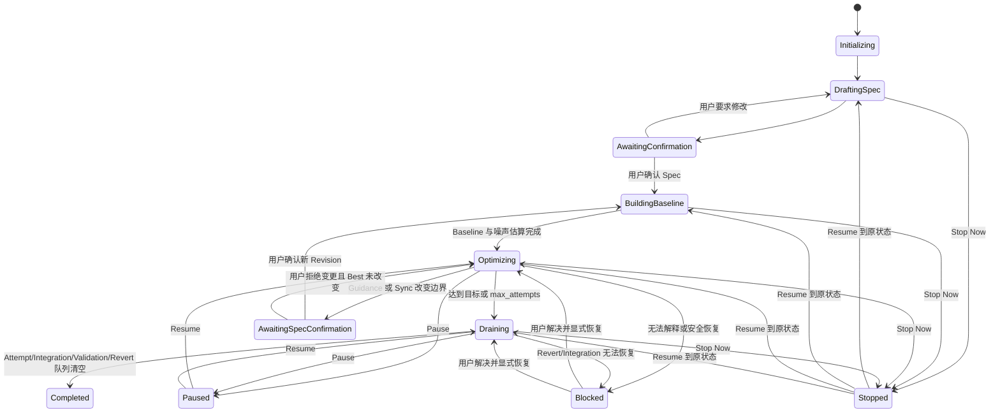

# Pika v1 状态机

## 1. Campaign 状态



`Paused` 不取消在途 Agent、Integration 或 Validation，只关闭新 Attempt dispatch。`Stopped` 会 cancel 活跃 ACP Prompt Turn，关闭自动恢复和归并，但保留全部状态。为正确 Resume，Campaign 表保存 `resume_state`。

Sync 不替换 Campaign 主状态，而设置 `dispatch_gate=sync`。这允许已有 Iteration 继续工作，同时禁止派生新 Attempt。UI 可以将其显示为 `Optimizing · Syncing`。

## 2. Attempt 状态

| 状态 | 含义 | 允许的下一个状态 |
|---|---|---|
| `queued` | 已占用 Attempt 序号，等待 Slot | `running`, `cancelled` |
| `running` | Iteration Agent 正在工作 | `awaiting_report`, `interrupted`, `cancelled` |
| `awaiting_report` | Prompt Turn 已结束但缺少必需 MCP 调用 | `running`, `interrupted`, `cancelled` |
| `ready_for_integration` | 代码、Summary 和正式 Metrics 已提交 | `refreshing`, `integrating`, `rejected` |
| `refreshing` | Base 陈旧，Agent 正在 rebase/重测 | `ready_for_integration`, `rejected`, `interrupted` |
| `integrating` | 持有 Integration Lease | `accepted`, `rejected`, `interrupted` |
| `interrupted` | Session/进程消失但工作可恢复 | 恢复到中断前非终态 |
| `accepted` | squash commit 已核验并推进 Best | 终态 |
| `rejected` | 正确性、性能、protected path 或测量门禁失败 | 终态 |
| `cancelled` | 用户 Stop 或显式取消 | 终态，可保留 worktree |

`awaiting_report` 没有自动超时和次数预算。Pika 在同一 ACP Session 无限 follow-up；进程失效则进入 `interrupted` 并用新 Session 继续。只有用户取消或其他 Campaign 停止条件可以结束该循环。

Attempt 创建时即消耗 `max_attempts`。Plan Session、恢复 Session、Integration、Validation、Revert 和 Sync 不消耗 Attempt 预算。

## 3. Integration 状态

```text
queued
  → lease_acquired
  → checking_base
  → refreshing              # base_sha != current best_sha
  → validating              # protected paths + correctness + paired metrics
  → git_mutating            # 已持久化 Operation Intent
  → verifying_git
  → committed               # Accepted + BestAdvanced 同事务
```

任一阶段进程崩溃后，Integration Lease 保留。恢复流程不得根据 PID 消失直接释放；必须核对 Operation Intent、Git HEAD、merge/revert 状态和 trailers。无法唯一判断“未执行/已执行/部分执行”时 Campaign 进入 Blocked。

## 4. Mainline Validation 状态

```text
queued → running_at_pinned_sha → metrics_updated → passed
                                      └──────────→ revert_required
revert_required → lease_acquired → reverting_latest_best → verified → reverted
                                                            └──────→ blocked
```

Validation 固定测试原 squash SHA，但 Revert 必须在最新 Best 上执行。Validation 不阻塞后续 Integration；Revert 获取同一个 Integration Lease。Revert 后所有活动 Attempt 收到 BestAdvanced，并在正式 Benchmark/完成/归并前刷新。

## 5. Sync 状态

| 状态 | 行为 |
|---|---|
| `requested` | 用户确认 remote、branch、待 Push SHA |
| `preparing` | 关闭新 Attempt dispatch，创建 `pika/sync/<id>` |
| `fetching` | 获取配置远端分支 |
| `merging` | Sync Agent merge 远端并解决冲突 |
| `awaiting_spec_confirmation` | 远端改变 protected Harness 或 Spec 输入 |
| `validating` | 完整正确性和 Best Metrics |
| `pushing` | Sync Intent 已持久化，普通 fast-forward push |
| `advancing_best` | 远端成功后 fast-forward 本地 Best |
| `completed` | Metrics、Sync Trail 与 BestAdvanced 已提交 |
| `failed` | 本地 Best 不变，记录原因 |

Push 成功而本地推进前崩溃时，恢复流程 fetch 远端并核对 Sync Intent 的 candidate SHA；完全匹配才补做 `advancing_best`，不匹配则 Blocked。

## 6. 恢复决策表

| SQLite 状态 | 外部事实 | 恢复动作 |
|---|---|---|
| Agent `running` | 对应 OS 进程不存在 | 标记 `interrupted`，保留 worktree，启动新 Session |
| `awaiting_report` | ACP Session 存活 | 同 Session 发送 completion follow-up |
| Integration Lease 存在 | Git 未变化、无 merge state | 恢复 Integration Agent，继续 Intent |
| Integration Lease 存在 | HEAD 已含合法 trailer commit | 核验 Diff/Metrics 后幂等完成事务 |
| Integration Lease 存在 | Git 处于 merge/revert 冲突 | 启动恢复 Agent解决，不释放 Lease |
| Sync `pushing` | remote SHA 等于 candidate SHA | 完成本地 Best 推进与事务 |
| Sync `pushing` | remote SHA 不等于 expected/candidate | Campaign `blocked` |
| Artifact 哈希不符 | 任意 | 停止危险推进并通知用户 |
| Managed Repo lock 无法获取 | 启动/恢复 | 拒绝启动，不修改仓库 |

所有恢复操作必须携带稳定 idempotency key。重复恢复只能返回先前结果或继续未完成步骤，不能创建第二个 Agent、第二次 Merge、第二个 Revert 或第二次 Push。
