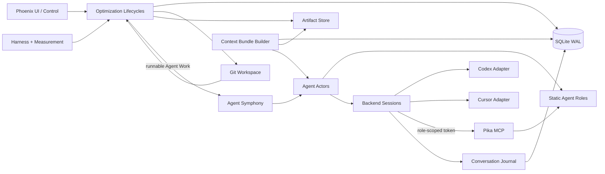

# Pika v2 代码架构

## 1. 部署与所有权

一个 Pika 进程只管理一个 Optimization 和一个 Git 仓库。进程拥有 SQLite、Artifact Workspace、内部 `pika/best` 分支、Attempt worktrees、HTTP UI/MCP Endpoint 和 Agent Backend 子进程。

Pika 只推进 Workspace 内部 Best。最终把 Best 合并到用户分支并 Push 远端的工作由 Pika 之外的独立 Code Agent 完成；v2 不包含 Sync Role、Sync 状态或远端写操作。

```text
Optimization Workspace
├── repo/                              # 配置绑定的 Git repo；也可以位于 Workspace 外
├── baseline/
│   ├── revisions/<revision>/
│   └── target/                        # 当前只读 Target Snapshot
├── attempts/<integer-id>/
│   ├── repo/                           # Round 1 Git worktree（兼容首轮布局）
│   ├── reference-projects.json         # 该 Attempt 冻结的 Reference manifest
│   └── rounds/<round>/
│       ├── repo/                       # stale refresh 的独立 Git worktree
│       ├── iteration-result.json
│       └── artifacts/                  # 当前 Round 独占测量与 Patch
├── refs/<id>/                         # Pika-owned 固定 Git checkout
├── agent-sessions/<session-id>/
├── follow-ups/<role>/<work-id>/
├── progress-summaries/<date>/
├── artifacts/
├── pika.sqlite3
└── pika.yaml
```

## 2. 模块关系



外部 seam 只有 Backend Adapter 和 HTTP/MCP transport。Role、Symphony 与领域 Lifecycle 不依赖 Codex/Cursor wire type。SQLite、Git 与本地文件均属于进程内可替代依赖，不通过公共 Role interface 暴露。

## 3. 深模块

### Optimization Runtime

负责启动/恢复 singleton Optimization、持有 Workspace lock、投影顶层状态以及协调 graceful drain/stop。它不实现任一 Agent Role 的步骤。

建议外部 interface：

```elixir
start(workspace)
snapshot()
pause()
resume()
drain(reason)
stop_now(reason)
```

### Baseline Lifecycle

隐藏 Baseline Revision、Review digest、Target Snapshot、Full Verification、初始 Best 与初始 Sampling Revision 的全部状态转换。用户批准与 Agent Result 都通过同一事务入口进入，不让 UI、MCP 或 Symphony复制门禁。

建议外部 interface：

```elixir
submit_definition(revision, manifest_receipt)
review(revision, decision, feedback)
finish_verification(revision, result_receipt)
project_work()
```

### Attempt Scheduler

分配整数 Attempt ID、冻结创建时 Best/Sampling/Guidance/Reference Projects、按 `iteration.agents` slots 启动并发工作、维护最近历史投影并施加 pending gate。`max_pending_attempts=0` 表示 pending 队列清空后才启动新的 Iteration 批次。

当 FIFO 队首 Attempt 的 Base 落后于当前 Best 时，Scheduler 不启动 Integration，而是给同一 Attempt 新建独立 Iteration Round workspace、Git worktree 和 branch。该 Attempt 保持队首，Initial User Prompt 要求只在当前 Round 执行 `git merge <current-best-sha>`；队列在 refresh 完成前不越过它。Actor 的 cwd、`PIKA_ATTEMPT_ROOT`、Candidate manifest 与终态 MCP 文件解析都绑定当前 Round；Integration 通过 `iteration_rounds` 定位当前 Candidate，不假设 `attempt/repo` 永远是最新候选。

### Integration Lifecycle

串行处理队首 Attempt，验证 Full Case Set，收集 Agent 的 per-Case judgement，执行硬门禁并管理 Git mutation intent。接受路径只有 `prepare_best_update` 可以授权修改 `pika/best`；`finish_integration` 核验实际 Git 后原子提交 Accepted Attempt、Best Revision 与 Metrics。

### Follow-up Lifecycle

为 Baseline Verify、Iteration 和 Integration 维护目标 follow-up 次数与生成器重试次数。配置专用 Follow-up Role 时串行生成消息；未配置时直接发送“继续”。Baseline Verify 耗尽使 Optimization 持久化失败后非零退出；Iteration/Integration 耗尽拒绝 Attempt。

### Progress Summary Lifecycle

每五分钟至多生成一个请求。若前一个请求仍在运行，多个 tick 合并成一次最新快照。请求只读取冻结状态、上一份 Summary 与增量 Turn，不改变 Optimization 状态。

### Agent Symphony

从各 Lifecycle 读取 runnable Agent Work，确保每项 Work 只有一个 Actor，并对每个 Role施加并发：Iteration 等于配置的 agents 数量，其余已配置 Role均为 1。不存在全局 `max_total_actors`。

Symphony 在启动 Actor 前读取该 Work 的 Backend Fallback Chain ledger。已排除的 Endpoint 会被跳过；全链不可用的 Work 保持 runnable-but-blocked，直到 reset 到期、用户重试或配置 digest 变化。

Symphony 不决定：

- Baseline 是否合理；
- Attempt 是否应进入 Integration；
- Integration 是否接受；
- stale Attempt 如何改变领域状态；
- Optimization 是否达到停止条件。

### Agent Runtime

Role Runtime 冻结一个 Session 的 Role contract、选中 Backend Endpoint、chain index/digest、System Prompt、Context Bundle、MCP tool catalog 和 completion condition。Actor 只根据领域 completion 投影判断是否终态；不得从自然语言尾输出推断成功。

Backend 配置不经过 Profile 引用。每次 Session 从当前 YAML 中读取展开后的完整 Backend Fallback Chain；正在运行的 Session 不热切换。eligible failure 原子地结束 Session 并排除当前 Endpoint，下一次 reconcile 用 Recovery Context 创建全新 Session。

### Context Bundle Builder

为每个 Backend Session 生成只读 `context/context.json` 入口和它引用的 Baseline、Cases、Metrics、Attempt history、Guidance 与 Event 文件。大对象不进入 System Prompt。

Context Bundle 创建后不可修改。Best、Sampling 或 Guidance 的变化通过 MCP/Event 暴露；需要新上下文时创建新 Session。stale refresh 必须创建新 Iteration Round、Session 和 Bundle。

### Conversation Journal

把 provider event 归一化成每行一个 Turn 的数据库记录。Follow-up、Recovery 和 Progress Summary 都从数据库重新生成 `messages.jsonl`；provider 原始 JSONL 只用于调试，不是恢复权威。

### Harness and Measurement

统一验证 `verify_cases.sh` 的单 JSON 与 `benchmark_cases.sh` 的 JSONL，计算 per-Case 中位数、相对差异、MAD、Noise Tolerance、加权聚合与有效 Pair 数。Agent提交工程判断，Pika重算数值与硬门禁。

### Git Workspace

维护 baseline branch、Attempt branch/worktree 和 `pika/best`。它核验实际 Git facts，但崩溃恢复时不 reset、clean、checkout、rebase 或自动解决冲突；新 Agent接管原现场。

Reference Project 使用 Workspace `refs/<id>` 中的独立固定 checkout，并通过 Attempt worktree 内 Git 忽略的 `ref/<id>` 软链接暴露。Attempt-owned `reference-projects.json` 冻结 ID、URL、说明、revision 和完整 SHA；Iteration Prompt 从该 manifest 构造，而不是从恢复时的实时配置构造。`ref/**` 始终是 protected path，不能进入 Candidate 或 Best。

stale refresh 在 Attempt branch 上 merge Best。Integration Accept 把 Candidate 有效 Patch squash 到 `pika/best`，因此每个 Accepted Attempt 只产生一个线性 Best commit。

## 4. 代码布局

```text
lib/pika/
├── optimization/
│   ├── bootstrap.ex
│   ├── config.ex
│   ├── persistence.ex
│   ├── runtime.ex
│   └── stop_policy.ex
├── baseline/
│   ├── lifecycle.ex
│   ├── definition.ex
│   ├── questions.ex
│   ├── target_snapshot.ex
│   └── workspace.ex
├── attempt/
│   ├── scheduler.ex
│   ├── lifecycle.ex
│   ├── history.ex
│   └── workspace.ex
├── integration/
│   ├── lifecycle.ex
│   ├── decision.ex
│   └── prompt_input.ex
├── followup/lifecycle.ex
├── progress_summary/lifecycle.ex
├── agent/
│   ├── symphony.ex
│   ├── actor.ex
│   ├── backend_failover.ex
│   ├── command_router.ex
│   ├── context_bundle.ex
│   ├── conversation_journal.ex
│   ├── directory.ex
│   └── work_projector.ex
├── agent_backend/
├── workspace_lock.ex
└── repo.ex
```

`Optimization.Runtime`、`Baseline.Lifecycle`、`Attempt.Scheduler/Lifecycle`、`Integration.Lifecycle`、`Followup.Lifecycle` 与 `ProgressSummary.Lifecycle` 是领域状态写入口。`Agent.CommandRouter` 只把文件/MCP 转成这些入口的命令；Web、Symphony 和 Backend 不复制门禁。

## 5. 监督树

```text
Pika.Application
├── Pika.WorkspaceLock
├── Pika.Repo
├── Phoenix.PubSub
├── Pika.AgentBackendSessionSupervisor
├── Pika.Agent.ActorSupervisor
├── Pika.Agent.Directory
├── Pika.Optimization.Bootstrap
├── Pika.Baseline.Questions
├── Pika.Optimization.Runtime
├── Pika.Agent.Symphony
└── PikaWeb.Endpoint
```

Baseline、Attempt、Integration、Follow-up 与 Progress Summary Lifecycle 是以 SQLite 事务为边界的无状态深模块，由 Symphony、Actor、MCP 或 UI 调用；它们不各自维持第二份进程内状态，因此不作为独立 Supervisor child。

## 6. 数据权威

| 数据 | 权威 |
|---|---|
| Target/Development/Candidate/Best 代码与 Git 现场 | Git 与只读 Target Snapshot |
| Optimization、Baseline、Attempt、Integration、Sampling 状态 | SQLite 当前状态表 |
| 标准化 Agent Turn | SQLite `conversation_turns` |
| 每个 Work 的 Backend Endpoint 排除状态 | SQLite `agent_backend_failures` |
| 最新逐 Case Metrics 与 Baseline Snapshot | SQLite Metrics 表 |
| Prompt Context、Result、日志、Patch、原始 JSON/JSONL | Artifact Workspace |
| Session Token 与活动 Actor 绑定 | 进程内 Agent Directory |
| 实时 UI | PubSub；不是持久权威 |

恢复顺序是 SQLite 领域状态 → 从数据库生成 Context/Recovery 文件 → 保持并检查实际 Git 现场 → 创建新 Backend Session。provider resume 永远不在正确性路径上。

## 7. 删除范围

v2 删除以下产品概念及所有代码、表、Prompt、MCP、UI 和测试入口：

- Campaign 与 `campaign_id` 产品层级；内部改用 singleton `optimization_id`。
- Sync Role、Sync Coordinator、Sync Workspace、Sync Intent 与远端 Push UI。
- Plan Role。
- Setup Merge Role。
- Agent Profile 引用与 Profile registry。

保留并重构：Agent Backend adapters、Actor/Directory、Symphony、Artifact Store、SQLite/Git 基础设施、Measurement evaluator 和 Integration intent 恢复模式。
