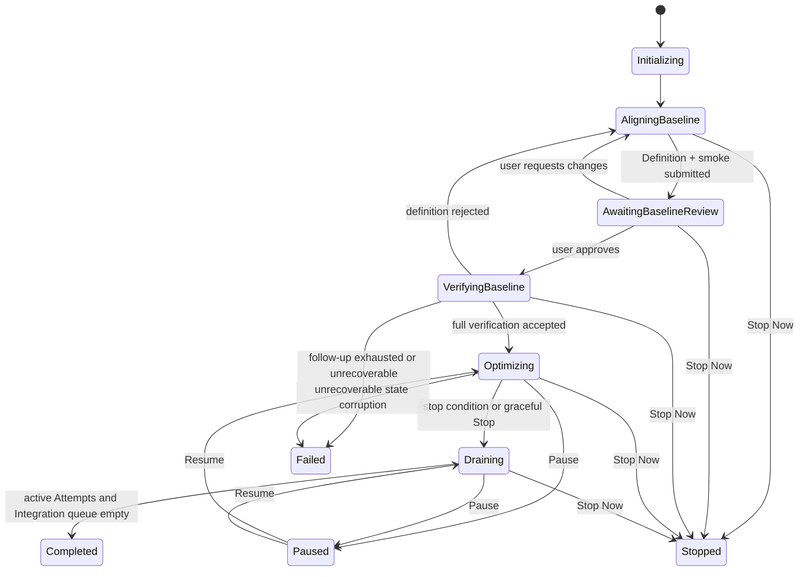
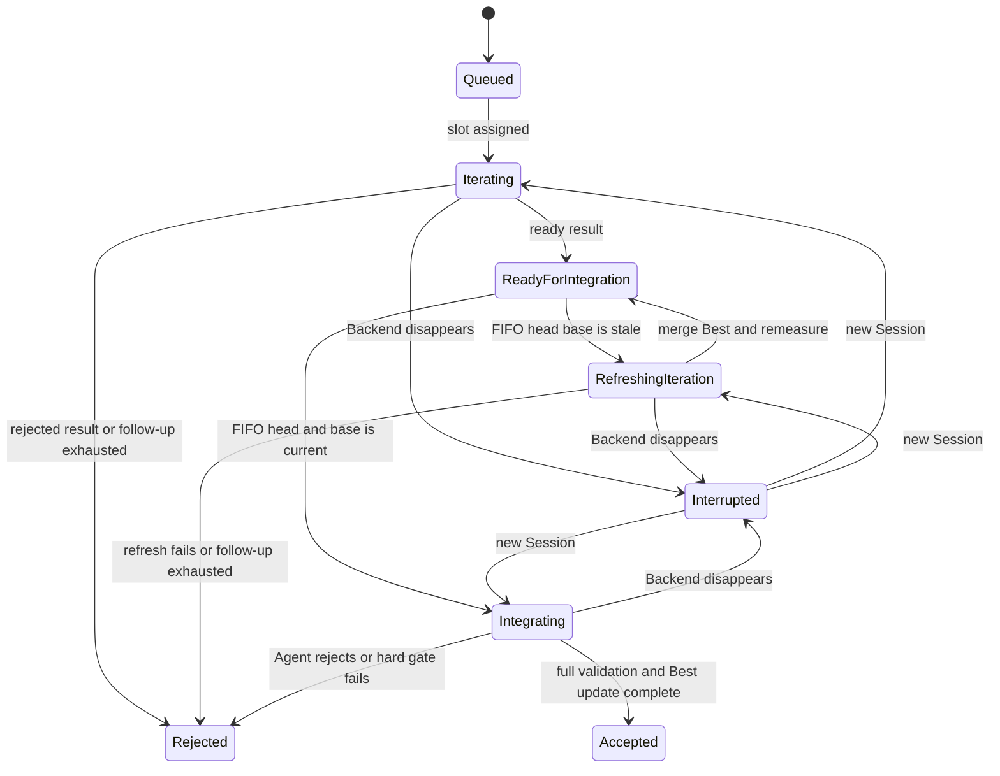

# Pika v2 状态机

## 1. Optimization



进入 `Optimizing` 后 Baseline Definition、Target Snapshot、Oracle、Harness 和 Full Case Set 永久冻结。需要改变它们时结束当前 Optimization，使用新的 v2 Workspace 启动另一个进程。

`Pause` 不取消在途工作，只停止新 Attempt spawn。`Draining` 不创建新 Attempt，但允许现有 Iteration、stale refresh 和 Integration 完成。`Stop Now` 中断所有 active Backend Turns，将未终态 Attempt 标记 cancelled/rejected，并禁止继续推进 Best。

## 2. Baseline Revision

```text
drafting
  → submitted
  → awaiting_review
      → changes_requested → superseded
      → approved
  → verifying
      → definition_rejected → superseded
      → accepted
```

`submitted` 只有在 Definition、Target bundle、Development commit、两个标准脚本和单 Case smoke evidence 都完整时成立。Review 绑定 commit、Definition 和所有依赖文件 digest；任一变化使旧 Review 失效。

Baseline Verify 得出通过或失败结论后都必须提交 Result 并调用 `finish_baseline_verification`。`definition_rejected` 必须携带 failure kind、reason 与 requested changes，并创建下一 Baseline Revision；新的 Alignment Session 必须读取之前的失败 Result。只有 Backend 在形成 Result 前中断时才由 Recovery/Follow-up 继续原 Work。只有 `accepted` 创建 Baseline Snapshot、Best Revision 0 和 Sampling Revision 0。

## 3. Attempt 与 Iteration Round



Attempt 创建时分配从 1 开始、永不复用的整数 ID，并冻结 Base Best、Sampling Revision 与 Guidance Revision。普通 Iteration 不因其他 BestAdvanced 热切换 Base。

stale 只在 Attempt 到达 FIFO 队首时检查。它保持队首，创建下一 Iteration Round 和新 Session；Initial User Prompt 明确旧/新 Best SHA，并要求在 Attempt branch 上 `git merge <current-best-sha>`、解决冲突和重跑采样。刷新期间后续 Attempt 不得越过队首。

## 4. Integration

```text
queued
  → validating_full_set
      → rejected
      → validation_ready
  → best_update_prepared       # validation receipt + Git intent
  → git_mutating
  → verifying_git
      → rejected_or_failed
      → accepted
```

`prepare_best_update` 在任何 `pika/best` mutation 之前验证全量 evidence 和硬门禁。Integration Agent随后把 Candidate 有效 Patch squash 到 expected Best。`finish_integration` 核验 parent、diff、protected paths、trailers 和实际 HEAD 后，原子提交 Accepted、Best Revision、最新 Metrics 与队列推进。

Reject 不修改 Best。若提供 Sampling Feedback，Attempt rejection、Sampling Revision 和队列释放在同一事务完成。

## 5. Follow-up

```text
requested
  → generating             # 配置专用 Follow-up Role
      → requested           # generator 未调用 MCP，仍有重试
      → generated
  → delivered
  → target_turn_running
      → target_terminal
      → requested           # 仍缺终态 MCP，仍有 target 次数
      → exhausted
```

未配置专用 Follow-up Role 时跳过 `generating`，消息固定为“继续”。生成器重试次数和目标 follow-up 次数分别持久化。

- Baseline Verify exhausted：Optimization `failed`，状态与 Artifact 落盘后进程非零退出。
- Iteration exhausted：Attempt `rejected`，reason=`follow_up_exhausted`。
- Integration exhausted：同上。
- Progress Summary 不使用专用 Follow-up Role；自身重试耗尽只使该 Request failed。

## 6. Progress Summary

```text
scheduled
  → requested
  → running
      → completed
      → failed
```

同一时刻至多一个 active Request。active 期间到达的五分钟 tick 只记录 `summary_due=true`；当前请求终态后，如仍到期，以最新状态创建一个请求，不追补每个错过的 tick。

## 7. Pending gate

pending 数量包括 `ready_for_integration`、`refreshing_iteration` 和 `integrating`。普通 `iterating` 不计入。

- `max_pending_attempts=0`：不限制。
- 正整数：pending 达到该值时停止创建新 Attempt。
- 已运行 Iteration 不被取消。
- 数量下降到阈值以下时恢复 spawn。

## 8. 恢复

崩溃后不调用 provider resume。Pika从 SQLite 重建新的 Context Bundle，并在新 Session 下按恢复次数创建 `recovery-01/`、`recovery-02/` 等不可变目录。System Prompt/User Prompt 指向最新 `messages.jsonl` 与 `recovery.json`。

Pika 保留工作目录的实际 Git 状态，不执行 reset、clean、checkout、rebase 或自动冲突处理。新 Agent先检查 `git status`、HEAD、index、merge state 与 Intent，再继续工作。终态 MCP 仍以实际 Git 和持久化 identity 为准。
